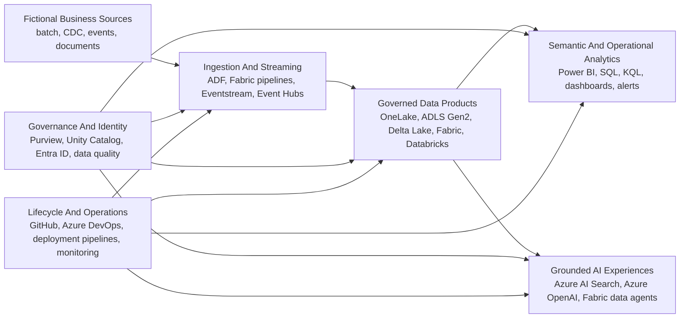

# Microsoft Data & AI Learning Blueprints

[](https://github.com/ravikiranpagidi/microsoft-data-ai-learning-blueprints/actions/workflows/lint.yml)
[](LICENSE)
[](#active-blueprints)
[](#microsoft-services-covered)
[](#microsoft-services-covered)

> **Practical Microsoft Data and AI implementation blueprints, from architecture decisions to tested demos.**

Microsoft Data and AI Learning Blueprints is a community learning and implementation playbook for people who want to move beyond isolated product exercises. Each active blueprint starts with a fictional business problem and develops it into an explainable solution with architecture diagrams, setup guidance, source code, sample data, validation, security considerations, cost notes, and a demonstration path.

The collection connects Microsoft Fabric, Power BI, Azure Data Factory, ADLS Gen2, Azure Databricks, Delta Lake, and enterprise delivery practices through realistic projects. The roadmap extends that foundation into semantic modeling, governance, CDC and streaming, Customer 360, Azure AI Search, Azure OpenAI, and governed conversational analytics.

## Why This Repository Exists

Official documentation is the source of truth for product behavior. It is not designed to be one end-to-end implementation for every business scenario. Short tutorials often demonstrate one feature but stop before quality, security, deployment, and operational concerns appear.

This repository bridges that gap.

| Need | How The Blueprints Address It |
| --- | --- |
| Learn a Microsoft service | Explain the mental model, prerequisites, and practical role in an architecture |
| Build a portfolio project | Provide fictional scenarios, code, diagrams, validation, and demo scripts |
| Prepare for an interview | Connect technical concepts to decisions, trade-offs, and working examples |
| Run a proof of concept | Offer a structured starting point with production readiness guidance |
| Create community content | Provide reproducible source material for articles, videos, workshops, and talks |
| Contribute to open source | Offer scoped work across docs, tests, diagrams, data, and implementation assets |

## Blueprint Philosophy

A blueprint is more than a folder of samples. An active blueprint should include:

- A specific fictional business problem and measurable questions.
- An end-to-end architecture with editable diagram source.
- Setup steps, prerequisites, and expected outputs.
- Versionable code, configuration, schemas, or notebooks.
- Synthetic sample data safe for public use.
- Tests or deterministic validation scripts.
- Security, governance, cost, and troubleshooting guidance.
- A demonstration script and extension exercises.
- Current official documentation links and clear preview labels.

Read the full [topic README template](docs/topic-readme-template.md) and [blueprint release gate](docs/repo-expansion-plan.md#blueprint-release-gate).

## Status Legend

| Status | Meaning |
| --- | --- |
| **Active** | Contains a working or reviewable implementation, documentation, validation, and demo path |
| **Planned** | Approved portfolio topic with documented scope, not yet presented as an implementation |
| **Preview-dependent** | Uses a product capability whose current availability or prerequisites must be verified |
| **Archived** | Preserved for reference but no longer maintained as a current implementation |

## Active Blueprints

| Blueprint | Business Scenario | What You Build |
| --- | --- | --- |
| [Microsoft Fabric Data Engineering](fabric-data-engineering-blueprint/README.md) | Retail Banking Customer Analytics | Source-to-Lakehouse medallion architecture with pipelines, notebooks, Delta tables, SQL views, data quality, Power BI guidance, governance, and CI/CD |
| [Microsoft Fabric Real-Time Intelligence](fabric-real-time-intelligence-blueprint/README.md) | Smart Logistics and Operations Monitoring | Event generation, Eventstream, Eventhouse, KQL analytics, Real-Time Dashboard, Activator patterns, Lakehouse history, and Power BI guidance |
| [Azure Lakehouse Starter Kit](azure-lakehouse-starter-kit/README.md) | Retail Customer Analytics | Metadata-driven ADF ingestion, ADLS Gen2, Azure Databricks Bronze/Silver/Gold, Delta Lake, Unity Catalog guidance, SQL, tests, and CI/CD templates |

## Planned Blueprint Portfolio

Each planned folder now contains a substantive scaffold with its scenario, implementation plan, diagram brief, sample contract, test plan, and demo outline. These folders are not Active implementations yet.

| Planned Folder | Primary Outcome | Fictional Scenario |
| --- | --- | --- |
| [Microsoft Fabric Power BI Semantic Modeling](microsoft-fabric-powerbi-semantic-modeling-blueprint/README.md) | Governed star schema, DAX, Direct Lake decisions, RLS, testing, and deployment | Commercial Performance Analytics |
| [Azure Databricks Unity Catalog](azure-databricks-unity-catalog-blueprint/README.md) | Catalog, storage, grants, isolation, fine-grained controls, audit, and lineage | Manufacturing Data Products |
| [Azure Data Engineering CI/CD](azure-data-engineering-cicd-blueprint/README.md) | Repeatable validation and Dev/Test/Prod promotion across Microsoft data assets | Enterprise Analytics Platform Delivery |
| [Azure Streaming And CDC](azure-streaming-cdc-blueprint/README.md) | Resilient order and inventory CDC into Delta Lake | Retail Operations Change Processing |
| [AI-Ready Customer 360](ai-ready-customer-360-blueprint/README.md) | Consent-aware customer data product for BI, features, and approved AI context | Omnichannel Customer 360 |
| [Azure Data Governance And Purview](azure-data-governance-purview-blueprint/README.md) | Catalog, classification, glossary, lineage, ownership, and access workflow | Retail Data Governance Office |
| [Azure OpenAI Enterprise RAG](azure-openai-rag-enterprise-blueprint/README.md) | Secured retrieval, grounding, citations, evaluation, feedback, and monitoring | Service Knowledge Assistant |
| [Fabric Data Agent And Copilot Analytics](fabric-data-agent-copilot-analytics-blueprint/README.md) | Governed data preparation, permissions, diagnostics, and evaluation for business Q&A | Service Operations Analytics |

See the detailed [repository expansion plan](docs/repo-expansion-plan.md).

## Learning Paths

### Azure Lakehouse Engineer

`Azure Lakehouse Starter Kit` -> `Streaming CDC` -> `Unity Catalog` -> `Data Engineering CI/CD`

Build batch and streaming lakehouse skills, then add governance and automated delivery.

### Microsoft Fabric Analytics Engineer

`Fabric Data Engineering` -> `Fabric Real-Time Intelligence` -> `Power BI Semantic Modeling` -> `Fabric Data Agent Analytics`

Connect historical engineering, operational events, trusted metrics, and governed conversational analytics.

### Enterprise AI Data Architect

`Azure Lakehouse Starter Kit` -> `AI-Ready Customer 360` -> `Purview Governance` -> `Azure OpenAI RAG` -> `Fabric Data Agent Analytics`

Build AI experiences on governed data products with explicit evaluation and access controls.

### Power BI And Semantic Model Engineer

`Fabric Data Engineering` -> `Power BI Semantic Modeling` -> `Customer 360` -> `Data Agent Analytics` -> `CI/CD`

Own the semantic contract from Gold data to business metrics, security, deployment, and question answering.

### Data Governance And Platform Lead

`Azure Lakehouse Starter Kit` -> `Fabric Data Engineering` -> `Purview Governance` -> `Unity Catalog` -> `CI/CD`

Connect ownership and policy to enforceable controls, environment strategy, and release evidence.

Open the complete [learning path guide](docs/learning-paths.md) for audiences, skills, projects, and outcomes.

## Cross-Platform Architecture



The diagram describes the learning portfolio, not one recommended architecture for every workload. Each blueprint documents its own service choices and alternatives.

## Architecture Gallery

The [architecture gallery plan](docs/architecture-gallery.md) defines:

- One versioned overview diagram per active topic.
- Excalidraw source beside every PNG export.
- Optional Draw.io and editable PowerPoint versions.
- Mermaid diagrams for accessible README flows.
- Naming, layout, trust boundary, and icon standards.
- A diagram brief for every planned blueprint.

## How To Use This Repository

### Study Without Cloud Deployment

1. Choose a learning path.
2. Read the topic scenario and architecture.
3. Inspect sample data, schemas, code, and expected outputs.
4. Review security, cost, and production checklists.
5. Complete the architecture and interview exercises.

### Run A Blueprint

1. Confirm prerequisites and current product availability.
2. Use a development subscription, workspace, or capacity.
3. Follow setup and parameterization instructions.
4. Run validation before and after deployment.
5. Execute the documented implementation order.
6. Compare results with expected outputs.
7. Follow cleanup steps to control cost.

### Turn It Into A Portfolio Demo

1. Rehearse the included demo script.
2. Explain the business problem before showing services.
3. Demonstrate one quality, security, or operational failure.
4. Explain a design alternative and why it was not selected.
5. Extend one dataset, metric, rule, or deployment check.
6. Link your work to a stable release or commit.

## Recommended Prerequisites

Not every blueprint requires every item.

- Basic SQL and data modeling concepts.
- Introductory Python or PySpark for engineering topics.
- Basic Power BI knowledge for semantic model topics.
- Basic KQL knowledge for Real-Time Intelligence topics.
- Git and pull request workflow familiarity.
- A development Azure subscription or Microsoft Fabric capacity when deploying.
- Permission to create the services listed by the selected blueprint.
- Awareness of cloud cost, identity, and data handling responsibilities.

Each topic README lists its exact prerequisites and safe cleanup steps.

## Microsoft Services Covered

| Capability | Services And Technologies |
| --- | --- |
| Microsoft Fabric | OneLake, Lakehouse, Warehouse, Data Pipelines, Notebooks, Spark, Eventstream, Eventhouse, KQL Database, Real-Time Dashboard, Activator |
| Power BI | Semantic models, star schema, DAX, Direct Lake, RLS, deployment pipelines, governed reports |
| Azure data engineering | Azure Data Factory, ADLS Gen2, Azure Databricks, Delta Lake, Event Hubs, Structured Streaming |
| AI and search | Azure OpenAI, Azure AI Search, Azure Functions, API Management, Fabric data agent concepts |
| Governance and identity | Microsoft Purview, Unity Catalog, Microsoft Entra ID, Key Vault, classification, lineage, data quality |
| Delivery and operations | GitHub Actions, Azure DevOps, Fabric Git integration, deployment pipelines, Azure Monitor, Application Insights |

See the full [Microsoft services map](docs/microsoft-services-map.md).

## Demo Scenarios

| Scenario | Demonstrates |
| --- | --- |
| Retail Banking Customer Analytics | Fabric Lakehouse engineering and Power BI-ready Gold data |
| Smart Logistics Operations | Streaming events, KQL analytics, real-time dashboards, and alerts |
| Retail Customer Analytics | Azure Lakehouse ingestion, Delta transformations, quality, governance, and CI/CD |
| Commercial Performance Analytics | Planned semantic modeling, DAX, RLS, Direct Lake decisions, and deployment |
| Manufacturing Data Products | Planned Unity Catalog governance and access controls |
| Service Knowledge Assistant | Planned enterprise RAG retrieval, grounding, citations, evaluation, and feedback |
| Omnichannel Customer 360 | Planned identity, consent, BI, feature, and approved AI context data products |
| Retail Operations CDC | Planned streaming change processing, replay, reconciliation, and monitoring |

All scenarios and datasets are fictional.

## Repository Structure

```text
.
|-- README.md
|-- CONTRIBUTING.md
|-- CODE_OF_CONDUCT.md
|-- CHANGELOG.md
|-- LICENSE
|-- .github/
|-- docs/
|-- fabric-data-engineering-blueprint/
|-- fabric-real-time-intelligence-blueprint/
|-- azure-lakehouse-starter-kit/
|-- microsoft-fabric-powerbi-semantic-modeling-blueprint/  planned scaffold
|-- azure-databricks-unity-catalog-blueprint/              planned scaffold
|-- azure-data-engineering-cicd-blueprint/                 planned scaffold
|-- azure-streaming-cdc-blueprint/                         planned scaffold
|-- ai-ready-customer-360-blueprint/                       planned scaffold
|-- azure-data-governance-purview-blueprint/               planned scaffold
|-- azure-openai-rag-enterprise-blueprint/                 planned scaffold
`-- fabric-data-agent-copilot-analytics-blueprint/         planned scaffold
```

The portfolio and recommended internal topic structure are documented in the [expansion plan](docs/repo-expansion-plan.md#4-updated-repository-structure).

## Contributing

Contributions are welcome when they improve learner outcomes, implementation quality, architecture clarity, or enterprise readiness.

High-value contributions include:

- Reproducible bug fixes.
- Validation and test improvements.
- Clearer setup and troubleshooting guidance.
- Architecture diagrams with editable source.
- Synthetic sample data and schemas.
- Security, governance, cost, and monitoring examples.
- DAX, SQL, KQL, Python, PySpark, pipeline, and deployment assets.
- Beginner exercises and role-based demo improvements.

Read [CONTRIBUTING.md](CONTRIBUTING.md), the [GitHub polish checklist](docs/github-polish-checklist.md), and the [community impact guide](docs/mvp-community-impact.md).

## Roadmap

The first 30 days standardize navigation, documentation, validation, and active blueprint quality. Days 31 to 60 target the Power BI semantic modeling blueprint. Days 61 to 90 target the Unity Catalog blueprint.

Read the complete [90-day roadmap](docs/repo-roadmap.md).

## Articles, Talks, And Community Learning

The repository includes a [ten-article series](docs/article-series.md), architecture presentation guidance, demo structures, and responsible impact tracking. Each public resource should link to a stable repository version and add explanation beyond the README.

## Author And Community

Maintained by [Ravikiran Pagidi](https://github.com/ravikiranpagidi) with contributions from the community.

Contributor acknowledgment should reflect actual commits, reviews, issues, documentation, talks, and other verifiable work. The goal is to make Microsoft Data and AI learning more practical, transparent, and reusable.

## Disclaimer

This is a community learning repository and is not official Microsoft documentation. Microsoft product behavior, licensing, capacity requirements, regional availability, preview status, and security guidance can change. Verify current requirements in official Microsoft documentation before production use.

If a blueprint helps, consider opening a discussion with what you learned, reporting a reproducible issue, or contributing a focused improvement.
