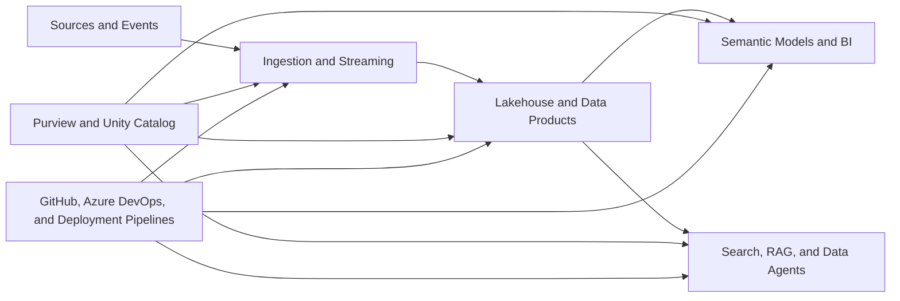

# Microsoft Services Map

This map shows how active and planned blueprints cover the Microsoft Data and AI platform. It is a learning map, not a product licensing or availability matrix.

## Coverage Matrix

| Blueprint | Core Microsoft Services | Primary Capability |
| --- | --- | --- |
| Fabric Data Engineering | Fabric Lakehouse, OneLake, Data Pipelines, Notebooks, Spark, SQL analytics endpoint, Power BI | Batch lakehouse engineering |
| Fabric Real-Time Intelligence | Eventstream, Eventhouse, KQL Database, Real-Time Dashboard, Activator, Power BI | Event-driven analytics |
| Azure Lakehouse Starter Kit | ADF, ADLS Gen2, Azure Databricks, Delta Lake, Unity Catalog, Power BI | Azure lakehouse foundation |
| Azure OpenAI RAG Enterprise | Azure OpenAI, Azure AI Search, Functions, API Management, Key Vault, Entra ID, Monitor | Grounded enterprise AI |
| Fabric Power BI Semantic Modeling | Fabric Lakehouse and Warehouse, Power BI, Direct Lake, Git integration, deployment pipelines | Trusted semantic layer |
| Azure Data Governance Purview | Microsoft Purview, Fabric, ADF, ADLS Gen2, Power BI, Entra ID | Catalog and governance operating model |
| Azure Databricks Unity Catalog | Azure Databricks, Unity Catalog, ADLS Gen2, Entra ID, Key Vault, Monitor | Lakehouse governance and access |
| Fabric Data Agent Analytics | Fabric Data Agent, Lakehouse, Warehouse, semantic models, KQL Database, Purview controls | Governed conversational analytics |
| Azure Data Engineering CI/CD | GitHub Actions, Azure DevOps, ADF, Databricks, Fabric deployment capabilities, Key Vault | Delivery automation |
| AI-Ready Customer 360 | Fabric or Azure Lakehouse, Power BI, Azure AI Search, ML or feature capabilities, Purview integration points | Reusable data product for BI and AI |
| Azure Streaming CDC | Event Hubs, Azure SQL CDC concepts, Azure Databricks Structured Streaming, Delta Lake, Monitor | Streaming and change propagation |

## Capability View

## Documentation Rule

Each blueprint must link to the current official documentation for the services it uses. It must also identify:

- Required capacity, licensing, or service tier where relevant.
- Preview features.
- Regional or tenant prerequisites.
- Identity and permission prerequisites.
- Known deployment or integration limitations.

Official documentation remains the source of truth for current product behavior.

## Current Official Reference Entry Points

- [Fabric data agent concepts](https://learn.microsoft.com/en-us/fabric/data-science/concept-data-agent)
- [Power BI semantic models in Microsoft Fabric](https://learn.microsoft.com/en-us/fabric/data-warehouse/semantic-models)
- [Fabric deployment pipelines](https://learn.microsoft.com/en-us/fabric/cicd/deployment-pipelines/intro-to-deployment-pipelines)
- [RAG with Azure AI Search](https://learn.microsoft.com/en-us/azure/search/retrieval-augmented-generation-overview)
- [Microsoft Purview data governance](https://learn.microsoft.com/en-us/purview/data-governance-overview)
- [Unity Catalog on Azure Databricks](https://learn.microsoft.com/en-us/azure/databricks/data-governance/unity-catalog/)
- [Unity Catalog row filters and column masks](https://learn.microsoft.com/en-us/azure/databricks/data-governance/unity-catalog/filters-and-masks/manually-apply)

Review these links again when a planned blueprint enters implementation because prerequisites and feature status can change.
