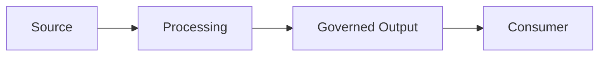

# Topic README Template

Use this template for new blueprint folders. Remove sections that truly do not apply, but do not remove security, cost, troubleshooting, validation, or demo guidance merely to shorten the page.

```markdown
# <Topic Title>

[Badges for primary Microsoft services, implementation language, validation, and license]

> <One sentence describing the business outcome and implementation scope.>

## Status

**Status:** Active | Preview-dependent | Archived

State what works today, what is conceptual, and which product capabilities require current documentation checks.

## What You Will Build

Describe the completed solution in practical terms. Name the input, processing stages, governed outputs, consumers, and validation evidence.

## Business Scenario

Introduce a fictional organization and a specific business problem.

### Business Questions

- <Question 1>
- <Question 2>
- <Question 3>

### Success Criteria

| Criterion | Expected Evidence |
| --- | --- |
| Functional | <Output or behavior> |
| Quality | <Test or reconciliation> |
| Security | <Permission or policy test> |
| Operations | <Log, alert, or run evidence> |

## Architecture




Explain the flow and link to `docs/architecture.md` for decisions and alternatives.

## Microsoft Services Used

| Service | Role | Why It Was Selected |
| --- | --- | --- |
| <Service> | <Role> | <Decision> |

Include official documentation links and label preview features or prerequisites.

## Prerequisites

- Required subscription, tenant, workspace, capacity, or service tier.
- Local tools and versions.
- Identity and permission requirements.
- Estimated setup time and expected cost drivers.

## Setup Steps

1. Clone the repository.
2. Configure local or cloud prerequisites.
3. Create synthetic sample resources.
4. Set environment-specific parameters.
5. Run validation before deployment.
6. Deploy or import assets.
7. Verify expected outputs.

Never place secrets, tenant IDs, production endpoints, or personal data in committed files.

## Repository Structure

```text
topic-blueprint/
|-- README.md
|-- docs/
|-- diagrams/
|-- src/ or notebooks/
|-- sql/
|-- samples/
|-- tests/
|-- demo/
`-- wiki/
```

Explain any topic-specific folders.

## Sample Data

| Dataset | Grain | Business Key | Purpose |
| --- | --- | --- | --- |
| <Dataset> | <One row per...> | <Key> | <Purpose> |

Confirm that all data is fictional and document intentional quality defects.

## Implementation Steps

### 1. <Stage Name>

Explain the purpose, inputs, code assets, validation, expected output, and failure behavior.

### 2. <Stage Name>

Repeat the same structure.

## Validation

```text
<Commands that validate code, configuration, data, and expected outputs>
```

| Check | Pass Condition |
| --- | --- |
| Syntax | All code and configuration parse successfully |
| Data | Keys, counts, references, and reconciliations pass |
| Security | Allowed and denied access tests behave as designed |
| Output | Expected business results match fixtures |

## Demo Walkthrough

1. State the fictional business problem.
2. Explain the architecture in under two minutes.
3. Show source data and contracts.
4. Run the primary path.
5. Demonstrate one quality or security failure.
6. Show the corrected business output.
7. Explain production changes and extension ideas.

Link to `demo/demo-script.md`.

## Security And Governance

- Identity model.
- Least-privilege roles.
- Sensitive data classification.
- Secret management.
- Audit and lineage expectations.
- Data retention and deletion considerations.
- Responsible AI controls where applicable.

## Cost Considerations

Identify the main cost drivers, safe demo defaults, shutdown steps, scale assumptions, and cost monitoring options. Do not publish unsupported cost estimates.

## Troubleshooting

| Symptom | Likely Cause | Resolution |
| --- | --- | --- |
| <Problem> | <Cause> | <Action> |

## Production Readiness Checklist

- [ ] Environment configuration is externalized.
- [ ] Identity and least privilege are tested.
- [ ] Quality checks block invalid promotion.
- [ ] Monitoring and ownership are defined.
- [ ] Backup, replay, or rollback is documented.
- [ ] Cost controls are enabled.
- [ ] Preview dependencies are accepted explicitly.

## Extension Ideas

- <Beginner extension>
- <Intermediate extension>
- <Enterprise extension>
- <Community contribution idea>

## Related Microsoft Learn Resources

Add current official links. Do not copy Microsoft Learn text.

- [<Resource name>](<official URL>)

## Related Articles And Sessions

- Article: Planned
- Demo video: Planned
- Meetup session: Planned

## Contributing

Link to the root contribution guide and list high-value contribution areas for this topic.

## Disclaimer

This is a community learning project and is not official Microsoft documentation. Verify current product behavior, availability, licensing, and security requirements in official documentation before production use.
```

## README Review Checklist

- [ ] The first screen identifies the topic, business outcome, and status.
- [ ] The README links to code and documentation that actually exist.
- [ ] Commands can be run from a clearly stated working directory.
- [ ] Diagrams use the same names as implementation assets.
- [ ] Expected outputs are concrete.
- [ ] Security and cost sections are specific to the topic.
- [ ] Preview features are labeled.
- [ ] No confidential data, secrets, or tenant-specific values are present.
- [ ] The disclaimer is included.
